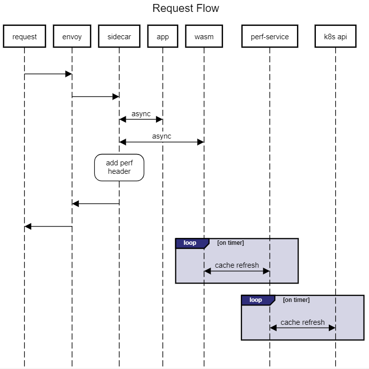

# Istio Rust WebAssembly Hands-on Labs

## Welcome

Welcome to the Hands-on Labs for building, deploying and testing an Envoy WebAssembly built in Rust running in an Istio sidecar in Kubernetes running in Codespaces.

<!--
We have over 180 attendees registered

- Please turn your video off to save bandwidth
- Please mute your audio except when you're asking a question
- Please raise your hand or post your question in Teams chat
  - We will pause at each section and ask for questions - remind us if we don't :)
- Please use `GitHub Discussions` for bugs, features or future session ideas
- The `dev container` will run locally - for this lab, please run in `Codespaces`
- The labs should work in `bash` - for this lab, please use the default `zsh` shell
- You will have access to the repo after the event and can experiment - we LOVE PRs!
- Have fun!
-->

## Learning Objectives

> Note that the Istio WebAssembly model is still very immature so expect a few bumps in the road as we learn together.

- Understand the inner-loop developer setup on Codespaces
- Understand the Envoy WebAssembly model
- Understand how to implement a plug-in using Rust
- Understand the Istio WebAssembly deployment model
- Deploy and test in Kubernetes using an Istio sidecar

This hands-on lab is open to members of the WW Azure Technical Community. To join, please visit: <https://aka.ms/joinwwazcom>

## Request Flow

> At the completion of Lab 4



## Errors

- `cargo test --target wasm32-unknown-unknown` is currently failing
  - upstream bug in proxy_wasm::*

## Create a Kubernetes Cluster

- Create the inner-loop Kubernetes dev cluster using k3d
  - This takes a couple of minutes to run - we will explain the details as we go

   ```bash

   make create

   # you may occasionally get a make error due to the wait for pods
   # you can safely ignore this error

   # check the pods
   kubectl get pods

   ```

## Verify the setup

```bash

# may have to retry a couple of times as the pods start
kubectl get pods

# check the app endpoint
make check

# verify the burst service
pushd burst
make check
popd

```

## Starting Over

- At any point, you can start over with a new cluster

```bash

cd /workspaces/istio-rust-webassembly-labs
make create

```

## Lab 1

- Lab 1 deploys a simple WebAssembly that adds a header to every request

  ```bash

  pushd lab1

  # build and deploy the plug-in
  make deploy

  # check for the custom header
  # retry until pod restarts
  make check

  # remove the plug-in
  make clean

  # there should not be a custom header
  # retry until pod restarts
  make check

  popd

  ```

## Lab 2

- Lab 2 reads the header from the filter config in `deploy/filter.yaml`

  ```bash

  pushd lab2

  # build and deploy the plug-in
  make deploy

  # check for the custom header
  # retry until pod restarts
  make check

  # remove the plug-in
  make clean

  # there should not be a custom header
  # retry until pod restarts
  make check

  popd

  ```

## Lab 3

- Lab 3 only applies the filter to the `/healthz` endpoint

  ```bash

  pushd lab3

  # build and deploy the plug-in
  make deploy

  # check the /healthz endpoint
  # custom header should appear
  # retry until pod restarts
  make check

  # custom header should not appear because of path
  http http://localhost:30080/version

  # customer header is added for healhz
  http http://localhost:30080/healthz

  # remove the plug-in
  make clean

  # there should not be a custom header
  # retry until pod restarts
  make check

  popd

  ```

## Lab 4

- Lab 4 reads the header from the `burst service` and dynamically sets the header on `/healthz`

  ```bash

  pushd lab4

  # build and deploy the plug-in
  make deploy

  # check the /healthz endpoint
  # custom header should appear
  # retry until pod restarts
  make check

  # run a 30 second load test
  make load-test

  # then repeat make check every 10-15 seconds to see current-load go up and then come back down
  make check
  # current-load will refresh every 15-20 seconds
  # load should peak in the 20s

  # remove the plug-in
  make clean

  # there should not be a custom header
  # retry until pod restarts
  make check

  popd

  ```

## Links

- Istio WebAssembly Docs - <https://istio.io/latest/docs/concepts/wasm/>
- Building Envoy filters with Rust and WebAssembly - <https://github.com/proxy-wasm/proxy-wasm-rust-sdk>
- OIDC Sample <https://docs.eupraxia.io/docs/how-to-guides/deploy-rust-based-envoy-filter/#building-of-the-http-filter>
- Unit testing with `wasm-bindgen-test` - <https://rustwasm.github.io/docs/wasm-bindgen/wasm-bindgen-test/index.html>

## Engineering Docs

- Team Working [Agreement](.github/WorkingAgreement.md)
- Team [Engineering Fundamentals Checklist](.github/EngineeringFundChecklist.md)
- CSE Engineering Fundamentals [Playbook](https://github.com/Microsoft/code-with-engineering-playbook)

## How to file issues and get help  

This project uses GitHub Discussions to track bugs and feature requests. Please search the existing issues before filing new issues to avoid duplicates. For new issues, file your bug or feature request as a new issue.

For help and questions about using this project, please post your issue to the GitHub Discusson in the repo.

## Contributing

This project welcomes contributions and suggestions.  Most contributions require you to agree to a Contributor License Agreement (CLA) declaring that you have the right to, and actually do, grant us the rights to use your contribution. For details, visit <https://cla.opensource.microsoft.com>

When you submit a pull request, a CLA bot will automatically determine whether you need to provide a CLA and decorate the PR appropriately (e.g., status check, comment). Simply follow the instructions provided by the bot. You will only need to do this once across all repos using our CLA.

This project has adopted the [Microsoft Open Source Code of Conduct](https://opensource.microsoft.com/codeofconduct/). For more information see the [Code of Conduct FAQ](https://opensource.microsoft.com/codeofconduct/faq/) or contact [opencode@microsoft.com](mailto:opencode@microsoft.com) with any additional questions or comments.

## Trademarks

This project may contain trademarks or logos for projects, products, or services.

Authorized use of Microsoft trademarks or logos is subject to and must follow [Microsoft's Trademark & Brand Guidelines](https://www.microsoft.com/en-us/legal/intellectualproperty/trademarks/usage/general).

Use of Microsoft trademarks or logos in modified versions of this project must not cause confusion or imply Microsoft sponsorship.

Any use of third-party trademarks or logos are subject to those third-party's policies.
